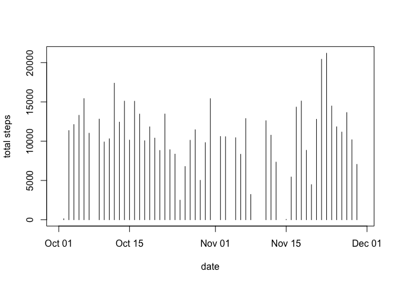
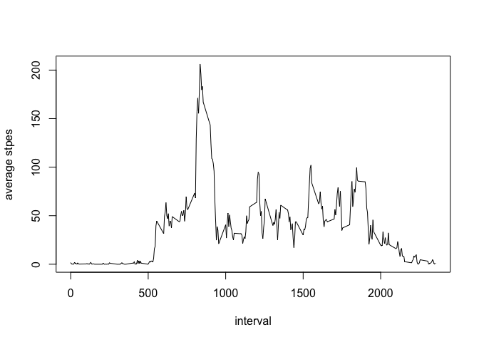
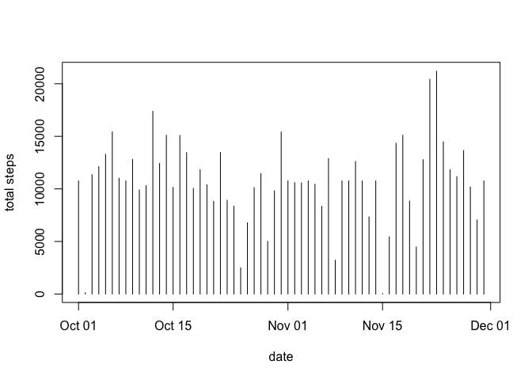
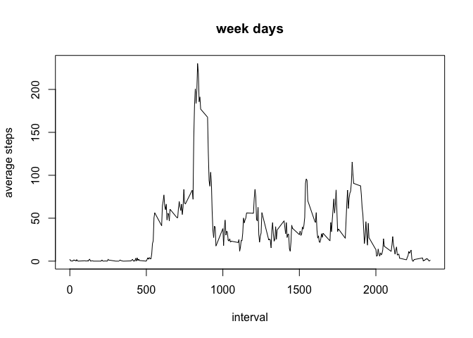
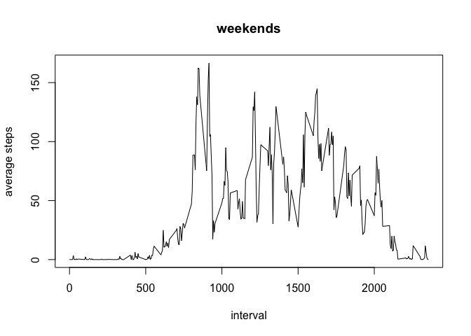

# Reproducible Research: Peer Assessment 1


## Loading and preprocessing the data

```r
activity <- read.csv("/Users/Angrybirdy/Documents/data_science/activity.csv",colClasses = c("numeric","POSIXct","numeric"))
steps <- data.frame(tapply(activity$steps,activity$date, sum))
steps <- cbind(as.Date(row.names(steps)),steps)
colnames(steps) = c("date","sum")
```

## mean total number of steps taken per day


```r
plot(steps$date,steps$sum,type = "h",xlab = "date",ylab = "total steps")
```



```r
summary(steps$sum)[c(3,4)]
```

```
## Median   Mean 
##  10760  10770
```


## the average daily activity pattern, and at 835th interval reaches the max

```r
series <- subset(activity, !is.na(activity$steps))
series <- data.frame(tapply(series$steps, series$interval, mean))
series <- cbind(as.numeric(row.names(series)),series)
colnames(series) <- c("interval","mean")
plot(series$interval,series$mean, type = "l",xlab = "interval", ylab = "average stpes")
```



```r
which.max(series$mean)
```

```
## 835 
## 104
```
## Imputing missing values, missing values are filled by average steps taken across each day on different interval

```r
countNA <- table(is.na(activity$steps))[2]
countNA
```

```
## TRUE 
## 2304
```

```r
Filled <- activity
for(i in 1:length(Filled$steps)){
      if(is.na(Filled$steps[i])){
            temp <- which(Filled$interval[i] == series$interval)
            Filled[i,1] <- as.numeric(series[temp,2])
      }
}
steps2 <- data.frame(tapply(Filled$steps,Filled$date, sum))
steps2 <- cbind(as.Date(row.names(steps2)),steps2)
colnames(steps2) = c("date","sum")
plot(steps2$date,steps2$sum,type = "h",xlab = "date",ylab = "total steps" )
```



```r
summary(steps2$sum)[c(3,4)]
```

```
## Median   Mean 
##  10770  10770
```


## Are there differences in activity patterns between weekdays and weekends?

```r
weekDay <- c("Monday","Tuesday","Wednesday","Thursday","Friday")
weekEnd <- c("Saturday","Sunday")
week <- weekdays(Filled$date)
for(i in 1:length(week)){
      if(length(which(week[i] == weekDay)) != 0){
           week[i] = "Weekdays" 
      }else if(which(week[i] == weekEnd)){
            week[i] = "Weekends"
      }
}
Filled <- cbind(Filled, week)
FilledWeekDays <- Filled[Filled$week == "Weekdays",]
FilledWeekEnds <- Filled[Filled$week == "Weekends",]
series2_1 <- data.frame(tapply(FilledWeekDays$steps, FilledWeekDays$interval, mean))
series2_2 <- data.frame(tapply(FilledWeekEnds$steps, FilledWeekEnds$interval, mean))
series2_1 <- cbind(as.numeric(row.names(series2_1)),series2_1)
series2_2 <- cbind(as.numeric(row.names(series2_2)),series2_2)
colnames(series2_1) <- c("interval","mean")
colnames(series2_2) <- c("interval","mean")
plot(series2_1$interval,series2_1$mean, type = "l",ylab= "average steps", xlab = "interval",main = "week days")
```



```r
plot(series2_2$interval,series2_2$mean, type = "l",ylab= "average steps", xlab = "interval", main = "weekends")
```


